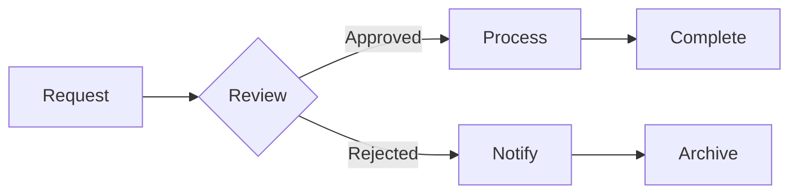

# Best Practices for Workflow Design

*Published on March 10, 2024 • 7 min read*

Creating effective automated workflows is both an art and a science. A well-designed workflow can transform your business operations, while a poorly designed one can create bottlenecks and frustration. Let's explore the key principles and best practices for designing efficient and scalable automation workflows.

## Foundation Principles

### 1. Clarity First
Every workflow should have:
- Clear starting and ending points
- Well-defined objectives
- Measurable outcomes
- Documented decision points

### 2. User-Centric Design
- Consider all stakeholders
- Design for ease of use
- Include clear error messages
- Provide status updates

### 3. Scalability
- Plan for growth
- Use modular design
- Implement versioning
- Consider performance impacts

## Key Components of Effective Workflows

### 1. Triggers
- Event-based activation
- Scheduled execution
- Manual initiation
- Conditional starting points

### 2. Actions
- Clear, atomic operations
- Error handling
- Retry mechanisms
- Logging and monitoring

### 3. Decision Points
- Clear conditional logic
- Default paths
- Exception handling
- Escalation procedures

## Design Patterns for Success

### 1. Sequential Workflows
Best for processes that follow a strict order:
- Document approvals
- Customer onboarding
- Order processing

### 2. Parallel Processing
Ideal for independent tasks:
- Multi-department reviews
- Batch processing
- Concurrent validations

### 3. State Machines
Perfect for complex processes:
- Order fulfillment
- Project management
- Customer service tickets

## Implementation Guidelines

### 1. Planning Phase
- Document current processes
- Identify optimization opportunities
- Define success metrics
- Create process diagrams

### 2. Development Phase
- Build in small iterations
- Test extensively
- Document thoroughly
- Include error handling

### 3. Deployment Phase
- Use staged rollout
- Monitor performance
- Gather user feedback
- Plan for maintenance

## Common Workflow Patterns

### 1. Approval Workflows

### 2. Data Processing Workflows

## Optimization Strategies

1. **Reduce Waiting Time**
   - Implement parallel processing
   - Use asynchronous operations
   - Set up automatic notifications

2. **Minimize Human Input**
   - Automate data entry
   - Use smart forms
   - Implement validation rules

3. **Improve Reliability**
   - Add error handling
   - Implement retry logic
   - Create audit trails

## Monitoring and Maintenance

### 1. Performance Metrics
- Processing time
- Error rates
- Completion rates
- Resource usage

### 2. Regular Reviews
- Workflow efficiency
- User feedback
- Error patterns
- Improvement opportunities

### 3. Continuous Improvement
- Regular updates
- Performance optimization
- Feature enhancement
- Security updates

## Conclusion

Effective workflow design is crucial for successful automation. By following these best practices and continuously refining your approach, you can create workflows that are efficient, scalable, and user-friendly.

Need help designing your automation workflows? [Contact our experts](/support) to get started with Senna Automation's professional workflow design services.