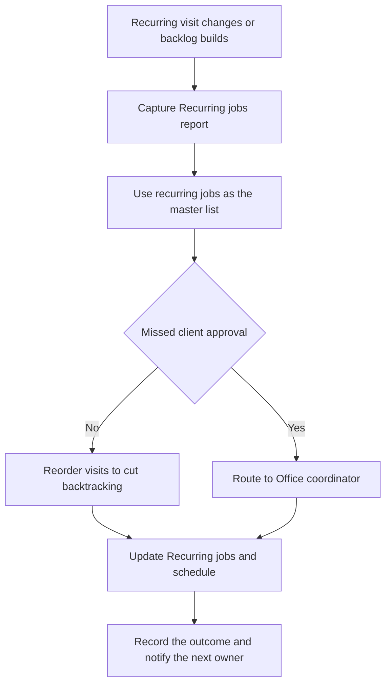

Recurring home service teams often feel stretched even when demand looks stable on paper. A cleaning company may have a full route calendar but still lose time to schedule changes and special requests. A lawn care company may see the day keep slipping because add-on visits and weather-driven changes bounce between inboxes and callbacks. A pest control company may have the same pattern whenever follow-up work, billing questions, or access issues need a manual decision.

The operating context is straightforward: the office team is not just “taking messages.” It is deciding what gets scheduled, what gets reassigned, what becomes a task, and what needs escalation. When those decisions happen in email threads or ad hoc conversations, recurring work drifts, exceptions stack up, and the day gets harder to recover. The control workflow below is built for that reality, with recurring jobs as the anchor and schedule changes routed through a consistent decision path.

Every financial example in this guide is illustrative and based on disclosed assumptions, not client results or guarantees.

## Why recurring home service operations stall on handoffs

Manual handoffs usually fail for the same reasons: the request arrives in one place, the schedule lives in another, and the person who can solve the problem is not the person who first hears about it. That gap creates avoidable back-and-forth, duplicated checks, and delayed decisions. In recurring service businesses, those delays are expensive because the work is time-sensitive and route-dependent.

The first fix is to stop treating each exception as a one-off. Instead, make the recurring jobs report the starting point for review, then use the current schedule as the place where changes are executed. If a coordinator has to search multiple systems to answer “what is due next,” the workflow is already leaking capacity.

Common pitfalls include letting technicians negotiate schedule changes directly, keeping non-billable work in free-text notes, and handling missed approvals as informal promises instead of tracked exceptions. Those habits create invisible work that never gets prioritized correctly.

## What the service operations control workflow must decide

A useful control workflow answers a small set of questions the same way every time. Is this change based on a recurring job, or is it a new one-time need? Does the visit need to move, split, or be reassigned? Does the work belong on the schedule as a task because it will not be invoiced? Is this issue something the office coordinator can resolve, or does it need escalation?

The owner here is the office coordinator. That role should receive exceptions first, because it sits closest to the schedule and can balance the day before the backlog spreads. The source of truth is the recurring jobs list paired with the schedule. If those disagree, the schedule should not become a second master record.

For quoting, estimating, or proposal contexts, keep the approval path clear: approved quotes move to the customer-facing owner or customer after internal approval. Do not let internal quote drafts circulate as if they were final commitments.

The practical rule set is simple: use recurring jobs as the master list, batch reschedule or reassign when possible, add unscheduled visits from recurring jobs, track non-billable work as tasks, and send unresolved exceptions to the office coordinator first. That sequence protects the calendar from random interruption while still giving urgent changes a path forward.

## How recurring jobs, schedules, and tasks should interact

Recurring jobs should define what should happen on a repeatable basis. The schedule should show when it will happen. Tasks should capture work that is necessary but not directly invoiced, such as supply runs, follow-up calls, and coordination steps. When those three elements stay distinct, the office team can recover capacity without losing visibility.

Use the schedule to reorder visits when that reduces travel waste and improves the flow of the day. Use batch changes when several appointments need to shift together. Use new visits from existing recurring jobs when the work belongs to an established service pattern. This keeps the team from creating duplicate records or improvising with side conversations.

A recurring service business should also standardize what happens when work changes after the schedule is already set. If a client request arrives late, the coordinator should decide whether to move the visit, create a follow-up task, or flag it for review. The key is not speed alone; it is speed with traceability.

## Exception handling rules for reschedules, added visits, and non-billable work

Exception handling is where most capacity is won or lost. Missed client approval should not silently become a held appointment. No crew available should trigger a reassignment or a queue decision, not a chain of informal messages. Billing mismatches should move to review instead of being patched inside the schedule. Same-day emergencies deserve a fast path, but even emergencies need a record of what changed and why.

When adding visits from recurring jobs, make sure the job record is complete enough to support the new appointment. If the recurring pattern is missing details, fix the source before forcing the schedule to absorb the error. That keeps the system from producing repeat exceptions.

## Workflow at a glance

## Define the operating contract

### Trigger and required inputs

The trigger is **recurring visit changes or backlog builds**.

Required inputs:

- Recurring jobs report.
- Schedule view.
- Client request or exception.
- Task queue.

### Decision rules and system actions

- Use recurring jobs as the master list.
- Batch reschedule or reassign when possible.
- Add unscheduled visits from recurring jobs.
- Track non-billable work as tasks.
- Send exceptions to office coordinator first.
- Reorder visits to cut backtracking.
- Reschedule or reassign multiple appointments.
- Create new visits from recurring jobs.
- Schedule follow-up and supply tasks.
- Flag unresolved exceptions for review.

### Exception handling

- Missed client approval.
- No crew available.
- Billing mismatch.
- Same-day emergency.

### Ownership and source of truth

The accountable owner is the office coordinator. The source of truth is the recurring jobs and schedule.

## Illustrative ROI sensitivity

These are illustrative planning scenarios—not client results, promises, or guarantees. Replace the transaction volume, minutes saved, loaded labor rate, baseline error or rework cost, assumed rework reduction, implementation cost, and monthly maintenance with your own measurements.

[[ROI_SENSITIVITY]]

## How to read the sensitivity range

Labor savings move with transaction volume, minutes removed from each handoff, and the loaded labor rate. Rework savings move with the current monthly cost of exceptions and the assumed reduction rate. Monthly benefit combines those two effects; first-year net then subtracts implementation plus twelve months of maintenance. Payback uses benefit after maintenance. Treat a negative first-year net or unavailable payback as a reason to narrow the first automation step, not as a number to hide.

## Preflight questions

- Which event creates the work item, and which system records that event first?
- Which fields must be present before an automated rule can run?
- Which status changes are deterministic, and which require an owner's judgment?
- Where do late, incomplete, duplicate, or contradictory records wait for review?
- Who owns each exception queue, and what is the acknowledgment expectation?
- Which system remains authoritative when two tools disagree?
- What baseline volume, handling time, and rework cost will be measured before launch?

## Sources used for industry context

These public sources support the operating context. The workflow recommendations are Senna Automation's analysis, and the ROI scenarios are illustrative planning estimates.

- [help.getjobber.com](https://help.getjobber.com/en/articles/recurring-jobs-report/): Run the recurring jobs report to review your recurring work, with columns covering schedules, clients, and billing.
- [help.getjobber.com](https://help.getjobber.com/en/articles/schedule-overview-new-schedule/): Actions on the schedule The More button on each schedule view is where you will find additional scheduling settings and tools, including: Reschedule & reassign Create new visits Toggle day view orientation Toggle weekend visibility Schedule settings Reschedule & reassign You can reschedule or reassign multiple appointments at once from the More button on the schedule.
- [help.getjobber.com](https://help.getjobber.com/en/articles/create-new-visits-for-existing-recurring-jobs-snow-removal-workflow-new-schedule/): The below sections cover how to set up your recurring jobs so that visits can be added using the schedule new visits tool.
- [help.getjobber.com](https://help.getjobber.com/en/articles/new-schedule/): Instead of manually deciding which appointment should come first, Jobber’s schedule can automatically reorder visits to reduce backtracking and make better use of travel time.

## Review this bottleneck with your own numbers

Bring one recent example of recovering capacity without adding administrative headcount to a [30-minute Workflow Bottleneck Review](/workflow-bottleneck-review). We will map the trigger, status rules, ownership handoffs, exception queue, and source of truth; replace the illustrative assumptions with your operating data; and identify the next practical step without promising a predetermined result.
