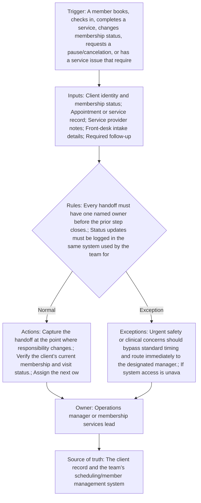

<!-- senna-roi-model-v1:{"scenarios":[{"name":"low","transactions_per_month":300,"minutes_saved_per_transaction":4,"loaded_labor_rate":22,"baseline_monthly_error_rework_cost":450,"error_rework_reduction_rate":0.15,"implementation_cost":1200,"monthly_maintenance":150,"monthly_labor_savings":440,"monthly_error_savings":67.5,"monthly_benefit":507.5,"annual_benefit":6090,"first_year_net":3090,"payback_months":3.3566433566433567},{"name":"base","transactions_per_month":800,"minutes_saved_per_transaction":6,"loaded_labor_rate":24,"baseline_monthly_error_rework_cost":1200,"error_rework_reduction_rate":0.25,"implementation_cost":2500,"monthly_maintenance":250,"monthly_labor_savings":1920,"monthly_error_savings":300,"monthly_benefit":2220,"annual_benefit":26640,"first_year_net":21140,"payback_months":1.2690355329949239},{"name":"high","transactions_per_month":1500,"minutes_saved_per_transaction":8,"loaded_labor_rate":28,"baseline_monthly_error_rework_cost":2500,"error_rework_reduction_rate":0.35,"implementation_cost":4500,"monthly_maintenance":400,"monthly_labor_savings":5600,"monthly_error_savings":875,"monthly_benefit":6475,"annual_benefit":77700,"first_year_net":68400,"payback_months":0.7407407407407407}]} -->

Membership operations in beauty and wellness depend on repeated transitions between the front desk, the service provider, and administration. Each transition is small on its own, but together they shape whether the client experiences a smooth visit or a confusing chain of callbacks, mixed messages, and delayed follow-up. When a handoff is incomplete, the next person has to reconstruct context, which slows the team and creates avoidable rework.

The fix is not to ask everyone to “communicate better.” The fix is to define what must be captured at the moment responsibility changes, where that information lives, who owns the next action, and what language can be shared with the client before the internal record is complete. In a labor-sensitive service environment, consistency matters because time is the scarce resource. Every minute spent chasing status is a minute not spent serving clients.

Every financial example in this guide is illustrative and based on disclosed assumptions, not client results or guarantees.

## The operational problem

Membership-based service businesses run on recurring visits, add-on services, pauses, cancellations, refunds, and issue resolution. Those events create a lot of handoffs. A client may check in with front desk, receive service from one provider, and then need a membership adjustment or follow-up from admin. If the team does not treat each transition as a controlled handoff, status updates become ad hoc and inconsistent.

That inconsistency shows up in predictable ways:

- Front desk promises timing before the provider has confirmed the next step.
- Providers leave notes in one place while admin checks another.
- Clients receive an update that does not match the internal record.
- No one is clearly accountable for the next action.

The result is not just frustration. It is a workflow bottleneck. Work waits on clarification, and clarification waits on someone noticing that the handoff was incomplete.

## Why this workflow breaks down

Most breakdowns come from three conditions.

First, ownership is ambiguous. A note may exist, but if no person is named to carry the task forward, the work can stall between teams. Second, the source of truth is fragmented. If scheduling, client records, and informal messages all carry pieces of the story, nobody knows which one is current. Third, client communication happens too early, before the internal record is complete, so the client hears a timing or status claim that later changes.

Membership businesses also face a volume problem. The more appointments and service changes you process, the more often small defects multiply. A single missed update can trigger a callback, a correction, or a supervisor intervention. That is why a standardized workflow matters more as volume grows.

## What a controlled handoff workflow needs

The workflow should be owned by the operations manager or membership services lead. That owner is responsible for defining the standard, training the team, and auditing whether the standard is followed.

At minimum, each handoff should capture seven inputs: client identity and membership status, appointment or service record, provider notes, front-desk intake details, required follow-up date and time, the owner for the next action, and the client communication preference. These fields are not busywork. They are the minimum context needed so the next person can act without guessing.

The team should use one system as the source of truth: the client record and the scheduling or member management system. That means the handoff is logged there, not in a side thread that no one checks later. If the system used for scheduling is also the team’s primary record, the workflow should keep the handoff inside that system whenever possible.

The sequence should be simple: capture the handoff when responsibility changes, verify membership and visit status, assign the next owner and due time, then send the client-facing update only after the internal record is complete. That order matters because it prevents the common failure mode where the client gets a confident answer before the team has verified the facts.

## Workflow at a glance

## Illustrative ROI sensitivity

These are illustrative planning scenarios—not client results, promises, or guarantees. Each row exposes the inputs so you can replace them with your own operating data.

| Scenario | Transactions/mo | Minutes saved/transaction | Loaded labor rate | Baseline rework/mo | Rework reduction | Implementation | Maintenance/mo | Labor savings/mo | Rework savings/mo | Benefit/mo | Annual benefit | First-year net | Payback months |
|---|---:|---:|---:|---:|---:|---:|---:|---:|---:|---:|---:|---:|---:|
| Low | 300 | 4 | $22.00 | $450.00 | 15% | $1,200.00 | $150.00 | $440.00 | $67.50 | $507.50 | $6,090.00 | $3,090.00 | 3.36 |
| Base | 800 | 6 | $24.00 | $1,200.00 | 25% | $2,500.00 | $250.00 | $1,920.00 | $300.00 | $2,220.00 | $26,640.00 | $21,140.00 | 1.27 |
| High | 1,500 | 8 | $28.00 | $2,500.00 | 35% | $4,500.00 | $400.00 | $5,600.00 | $875.00 | $6,475.00 | $77,700.00 | $68,400.00 | 0.74 |

## How to read the sensitivity range

Labor savings move with transaction volume, minutes removed from each handoff, and the loaded labor rate. Rework savings move with the current monthly cost of exceptions and the assumed reduction rate. Monthly benefit combines those two effects; first-year net then subtracts implementation plus twelve months of maintenance. Payback uses benefit after maintenance. Treat a negative first-year net or unavailable payback as a reason to narrow the first automation step, not as a number to hide.

## The operating contract

- **Trigger:** A member books, checks in, completes a service, changes membership status, requests a pause/cancelation, or has a service issue that requires follow-up.
- **Required inputs:** Client identity and membership status; Appointment or service record; Service provider notes; Front-desk intake details; Required follow-up date/time; Owner for next action; Client communication preference
- **Decision rules:** Every handoff must have one named owner before the prior step closes.; Status updates must be logged in the same system used by the team for scheduling or client records.; If a task cannot be completed immediately, the next action and due time must be recorded before the handoff ends.; Client-facing updates must use approved language and include only verified status.; Any membership pause, cancelation, refund, or service complaint requires escalation to a supervisor or designated admin owner.; If the service provider cannot confirm the next step, the front desk must not promise timing to the client.
- **System actions:** Capture the handoff at the point where responsibility changes.; Verify the client’s current membership and visit status.; Assign the next owner and due time.; Send the status update to the client after the internal record is complete.; Route exceptions to the designated escalation owner.; Audit a sample of handoffs weekly for missing ownership or incomplete updates.
- **Exception path:** Urgent safety or clinical concerns should bypass standard timing and route immediately to the designated manager.; If system access is unavailable, log the handoff on a temporary approved form and reconcile it in the source system as soon as access returns.; If the client requests a channel not supported for sensitive details, use the approved alternative communication path.
- **Accountable owner:** Operations manager or membership services lead
- **Source of truth:** The client record and the team’s scheduling/member management system

## Preflight questions

- Which event creates the work item, and which system records that event first?
- Which fields must be present before an automated rule can run?
- Which status changes are deterministic, and which require an owner's judgment?
- Where do late, incomplete, duplicate, or contradictory records wait for review?
- Who owns each exception queue, and what is the acknowledgment expectation?
- Which system remains authoritative when two tools disagree?
- What baseline volume, handling time, and rework cost will be measured before launch?

## Evidence boundary

These public sources support the factual context below. The workflow design and control rules are recommendations; the ROI scenarios are illustrative planning models.

- The median annual wage for this group was $35,110 in May 2024, which was lower than the median annual wage for all occupations of $49,500. ... ([Authoritative source 1](https://www.bls.gov/ooh/personal-care-and-service/))
- Skincare specialists provide cleansing and other face and body treatments to enhance a person’s appearance. ([Authoritative source 2](https://www.bls.gov/ooh/personal-care-and-service/skincare-specialists.htm))
- Personal appearance workers help us look our best. ([Authoritative source 3](https://www.bls.gov/careeroutlook/2018/article/personal-appearance-workers.htm))

## Review this bottleneck with your own numbers

Bring one recent service administration handoff workflow — customer handoff and status communication exception to a [30-minute Workflow Bottleneck Review](/workflow-bottleneck-review). We will map the trigger, status rules, ownership handoffs, exception queue, and source of truth; replace the illustrative assumptions with your operating data; and identify the next practical step without promising a predetermined result.
