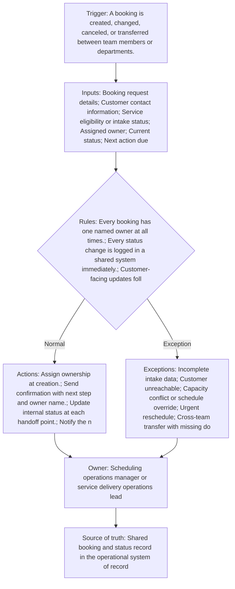

<!-- senna-roi-model-v1:{"scenarios":[{"name":"low","transactions_per_month":500,"minutes_saved_per_transaction":3,"loaded_labor_rate":28,"baseline_monthly_error_rework_cost":1200,"error_rework_reduction_rate":0.1,"implementation_cost":3000,"monthly_maintenance":250,"monthly_labor_savings":700,"monthly_error_savings":120,"monthly_benefit":820,"annual_benefit":9840,"first_year_net":3840,"payback_months":5.2631578947368425},{"name":"base","transactions_per_month":1500,"minutes_saved_per_transaction":5,"loaded_labor_rate":32,"baseline_monthly_error_rework_cost":3500,"error_rework_reduction_rate":0.18,"implementation_cost":7500,"monthly_maintenance":500,"monthly_labor_savings":4000,"monthly_error_savings":630,"monthly_benefit":4630,"annual_benefit":55560,"first_year_net":42060,"payback_months":1.8159806295399517},{"name":"high","transactions_per_month":4000,"minutes_saved_per_transaction":7,"loaded_labor_rate":38,"baseline_monthly_error_rework_cost":9000,"error_rework_reduction_rate":0.25,"implementation_cost":15000,"monthly_maintenance":900,"monthly_labor_savings":17733.333333333336,"monthly_error_savings":2250,"monthly_benefit":19983.333333333336,"annual_benefit":239800.00000000003,"first_year_net":214000.00000000003,"payback_months":0.7860262008733624}]} -->

In education services booking operations, the handoff is often where good service becomes inconsistent service. A request starts in one queue, moves to another team, and then depends on someone remembering to update the next owner and the customer. When that sequence is not standardized, staff spend time reconciling status, re-answering the same questions, and cleaning up avoidable scheduling mistakes.

The result is rarely a single catastrophic failure. It is usually a pattern of small frictions: a parent or student is told to expect a callback that never arrives, an intake form is complete but not visible to the next coordinator, or a booking is technically “in progress” in one system and “waiting” in another. Over time, those gaps create rework, longer response times, and more follow-up burden on already busy scheduling teams.

A reliable handoff process does not need to be elaborate. It needs to be explicit, owned, and easy to audit. For this workflow, the key control is simple: every booking has one named owner, every status change is recorded in the shared system immediately, and every customer-facing update follows a consistent cadence so the customer never has to guess who is responsible or what happens next.

## Why this workflow breaks down

Most booking and scheduling problems are not caused by a lack of effort. They are caused by missing process boundaries. The most common failure points are:

- **Unclear ownership at transfer points.** If a booking can sit between teams without a named owner, nobody feels accountable for the next action.
- **Incomplete minimum data.** Transfers happen before eligibility, contact details, service type, or timing constraints are fully captured.
- **Status updates stored in side channels.** Email, chat, and spreadsheets drift away from the operational system of record.
- **No defined escalation threshold.** A stalled booking can wait too long because “someone is probably handling it.”
- **Exceptions handled ad hoc.** Urgent reschedules and cross-team transfers get improvised responses, which makes them harder to repeat safely.

The practical fix is to treat status communication as part of the work, not as an extra courtesy. In high-volume environments, that distinction matters because the same staff who are coordinating the booking are also absorbing questions, exceptions, and missed-touch follow-ups.

## What a reliable handoff and status process needs

A good operating design starts with the shared booking record as the source of truth. That record should contain the booking request details, customer contact information, service eligibility or intake status, assigned owner, current status, next action due date, and communication channel history. If a detail is essential for the next owner, it belongs in the system before the handoff happens.

The required minimum data set before transfer should be strict enough to prevent noise but flexible enough to avoid blocking valid work. At minimum, the next owner should know:

- what service or appointment is being scheduled,
- who the customer is and how to reach them,
- whether intake or eligibility is complete,
- what status the item is currently in,
- what action is due next, and by when,
- and whether any customer communication has already been sent.

The customer-facing message should also be standardized. It should confirm the booking status, name the current owner, and explain the next step and timing. That consistency reduces uncertainty and lowers the number of “just checking in” messages that staff have to answer manually.

### Ownership and exception handling

The workflow owner should be a scheduling operations manager or service delivery operations lead. Their job is not to process every booking. Their job is to keep the rules intact, review exceptions, and make sure handoffs do not degrade into private workarounds.

Exception handling should be explicit:

- **Incomplete intake data:** pause transfer, request missing fields, and log the blocker in the shared record.
- **Customer unreachable:** record the contact attempts, set the next follow-up date, and keep the booking visible rather than burying it in a personal inbox.
- **Capacity conflict or schedule override:** route to the approved decision-maker and document the reason for the override.
- **Urgent reschedule:** treat as a priority path with a shortened update cadence and clear escalation owner.
- **Cross-team transfer with missing documentation:** do not send the item forward “for awareness”; return it to the sender or hold it in a named exception queue.

Exceptions should be tracked separately and reviewed weekly. That review is where recurring failure modes become visible. If the same exception repeats, it is usually a sign that the process definition or the intake form is incomplete.

## A practical operating model for booking teams

A workable cadence is usually easier to sustain than a perfectly designed one. Start with three checkpoints:

1. **At creation:** assign the owner and send a confirmation with the next step.
2. **At every handoff:** update the internal status and notify the next owner.
3. **At any meaningful change:** send a customer update if timing, owner, or status changes.

## Workflow at a glance

## Illustrative ROI sensitivity

These are illustrative planning scenarios—not client results, promises, or guarantees. Each row exposes the inputs so you can replace them with your own operating data.

| Scenario | Transactions/mo | Minutes saved/transaction | Loaded labor rate | Baseline rework/mo | Rework reduction | Implementation | Maintenance/mo | Labor savings/mo | Rework savings/mo | Benefit/mo | Annual benefit | First-year net | Payback months |
|---|---:|---:|---:|---:|---:|---:|---:|---:|---:|---:|---:|---:|---:|
| Low | 500 | 3 | $28.00 | $1,200.00 | 10% | $3,000.00 | $250.00 | $700.00 | $120.00 | $820.00 | $9,840.00 | $3,840.00 | 5.26 |
| Base | 1,500 | 5 | $32.00 | $3,500.00 | 18% | $7,500.00 | $500.00 | $4,000.00 | $630.00 | $4,630.00 | $55,560.00 | $42,060.00 | 1.82 |
| High | 4,000 | 7 | $38.00 | $9,000.00 | 25% | $15,000.00 | $900.00 | $17,733.33 | $2,250.00 | $19,983.33 | $239,800.00 | $214,000.00 | 0.79 |

## How to read the sensitivity range

Labor savings move with transaction volume, minutes removed from each handoff, and the loaded labor rate. Rework savings move with the current monthly cost of exceptions and the assumed reduction rate. Monthly benefit combines those two effects; first-year net then subtracts implementation plus twelve months of maintenance. Payback uses benefit after maintenance. Treat a negative first-year net or unavailable payback as a reason to narrow the first automation step, not as a number to hide.

## The operating contract

- **Trigger:** A booking is created, changed, canceled, or transferred between team members or departments.
- **Required inputs:** Booking request details; Customer contact information; Service eligibility or intake status; Assigned owner; Current status; Next action due date; Communication channel history
- **Decision rules:** Every booking has one named owner at all times.; Every status change is logged in a shared system immediately.; Customer-facing updates follow a standard cadence and template.; Handoffs require a required minimum data set before transfer.; Escalations trigger when a booking is waiting beyond a defined threshold.; Exceptions are tracked separately and reviewed weekly.
- **System actions:** Assign ownership at creation.; Send confirmation with next step and owner name.; Update internal status at each handoff point.; Notify the next owner when work is ready.; Send customer update when timing, owner, or status changes.; Flag stalled items for escalation and review.
- **Exception path:** Incomplete intake data; Customer unreachable; Capacity conflict or schedule override; Urgent reschedule; Cross-team transfer with missing documentation
- **Accountable owner:** Scheduling operations manager or service delivery operations lead
- **Source of truth:** Shared booking and status record in the operational system of record

## Preflight questions

- Which event creates the work item, and which system records that event first?
- Which fields must be present before an automated rule can run?
- Which status changes are deterministic, and which require an owner's judgment?
- Where do late, incomplete, duplicate, or contradictory records wait for review?
- Who owns each exception queue, and what is the acknowledgment expectation?
- Which system remains authoritative when two tools disagree?
- What baseline volume, handling time, and rework cost will be measured before launch?

## Evidence boundary

These public sources support the factual context below. The workflow design and control rules are recommendations; the ROI scenarios are illustrative planning models.

- Unemployment rates and earnings by educational attainment ([Authoritative source 1](https://www.bls.gov/emp/chart-unemployment-earnings-education.htm))
- Tables Created by BLS ([Authoritative source 2](https://www.bls.gov/oes/tables.htm))
- Employment, Hours, and Earnings from the Current Employment Statistics survey (National) Home Page ([Authoritative source 3](https://www.bls.gov/ces/))

## Review this bottleneck with your own numbers

Bring one recent booking and scheduling workflow — customer handoff and status communication exception to a [30-minute Workflow Bottleneck Review](/workflow-bottleneck-review). We will map the trigger, status rules, ownership handoffs, exception queue, and source of truth; replace the illustrative assumptions with your operating data; and identify the next practical step without promising a predetermined result.
