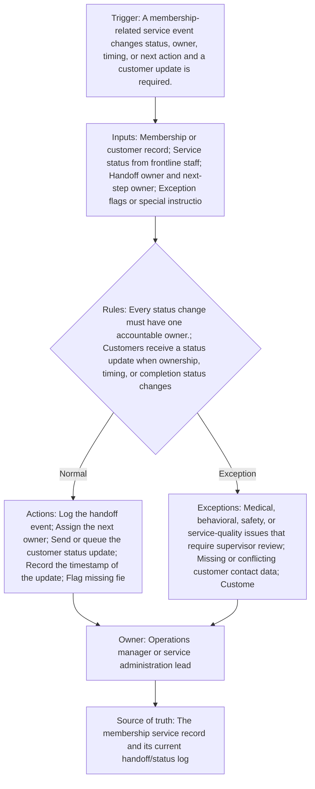

<!-- senna-roi-model-v1:{"scenarios":[{"name":"low","transactions_per_month":300,"minutes_saved_per_transaction":2,"loaded_labor_rate":18,"baseline_monthly_error_rework_cost":250,"error_rework_reduction_rate":0.15,"implementation_cost":1500,"monthly_maintenance":150,"monthly_labor_savings":180,"monthly_error_savings":37.5,"monthly_benefit":217.5,"annual_benefit":2610,"first_year_net":-690,"payback_months":22.22222222222222},{"name":"base","transactions_per_month":800,"minutes_saved_per_transaction":4,"loaded_labor_rate":22,"baseline_monthly_error_rework_cost":750,"error_rework_reduction_rate":0.25,"implementation_cost":3000,"monthly_maintenance":250,"monthly_labor_savings":1173.3333333333335,"monthly_error_savings":187.5,"monthly_benefit":1360.8333333333335,"annual_benefit":16330.000000000002,"first_year_net":10330.000000000002,"payback_months":2.7006751687921975},{"name":"high","transactions_per_month":1500,"minutes_saved_per_transaction":6,"loaded_labor_rate":28,"baseline_monthly_error_rework_cost":1800,"error_rework_reduction_rate":0.35,"implementation_cost":6000,"monthly_maintenance":450,"monthly_labor_savings":4200,"monthly_error_savings":630,"monthly_benefit":4830,"annual_benefit":57960,"first_year_net":46560,"payback_months":1.36986301369863}]} -->

Pet services membership operations often look simple from the outside: a customer books, a team member completes the service, and the customer gets a status update. In practice, the handoff chain is where things start to wobble. Messages get sent from memory, ownership is assumed instead of assigned, and the next person in line is not always clear on whether the work is complete, delayed, or waiting on approval.

That problem is especially visible in high-volume service environments where frontline staff are juggling animal care, scheduling, billing, and customer questions at the same time. The result is not just slow communication. It is avoidable rework: duplicate follow-up, missed updates, unresolved exceptions, and customer uncertainty that lands back on the team. A standardized service administration handoff workflow gives the organization a single source of truth for who owns the next step, when the customer should be updated, and what must happen before a message goes out.

Every financial example in this article is illustrative and based on disclosed assumptions, not client results or guarantees. The goal is to help you estimate whether your current handoff path is leaking time and creating preventable service friction before you decide to change systems.

## Why handoff and status communication break down in membership operations

The root cause is usually not a lack of effort. It is a lack of one clear operating rule: every status change needs one accountable owner. When that rule does not exist, staff fill the gap with habits that vary by shift, location, or urgency. One person texts the customer immediately, another waits until the end of the day, and a third assumes the receptionist already handled it.

In pet services, the situation can be more complicated because the service itself may depend on animal condition, customer preferences, or membership terms. A customer update can be routine one moment and exception-heavy the next. That is why the workflow should distinguish between normal handoffs and cases that need supervisor review before anything is communicated.

## What a standardized service administration handoff workflow should include

A good workflow does not need to be elaborate. It needs to be explicit. The minimum structure should include:

- A trigger: a membership-related service event changes status, owner, timing, or next action.
- Inputs: the membership or customer record, frontline status, handoff owner, next-step owner, exception flags, and communication preferences.
- Actions: log the handoff, assign the next owner, send or queue the customer update, timestamp the update, and flag missing fields.
- Rules: one accountable owner per status change, a standard message format, and no customer message until unresolved exceptions are routed to a human owner.
- Source of truth: the membership service record and its current handoff/status log.

This is not just an administrative preference. It is the mechanism that keeps the team aligned when the same event touches multiple people.

## Where delays and rework typically occur

The most common failure points are predictable:

1. **Unclear ownership at transition points.** A service is done, but nobody has formally accepted the next action.
2. **Missing or conflicting contact data.** Staff are ready to send the update, but the communication channel is wrong or incomplete.
3. **Exceptions left to interpretation.** Medical, behavioral, safety, or service-quality issues stay in limbo because no one wants to overstep.
4. **Membership adjustments mixed into service updates.** Payment or credit questions often need approval and can delay the customer message.
5. **Inconsistent wording.** If each employee rewrites the same update differently, the organization loses clarity and auditability.

The fix is not to send more messages. It is to make the message flow depend on a structured handoff record.

## How to estimate the operational impact before changing systems

Before you change software or redesign a process, estimate how much time is being spent on handoff cleanup and update chasing. A practical approach is to measure:

- how many membership-related handoffs happen per month,
- how many minutes each one takes when the process is smooth,
- how often staff need to re-contact customers or correct a prior update,
- and how much time is lost resolving missing information or exception cases.

That is the kind of model used in workflow automation ROI analysis: labor capacity, rework reduction, cycle time, and full cost should all be included. The point is not to promise a return. It is to identify whether the current process is consuming enough staff time to justify standardization.

If you are building your own estimate, keep it conservative. Use only the handoffs you can observe in the record, and separate routine communication from exception follow-up. The more you mix those together, the easier it is to overstate the benefit of a workflow change.

## Workflow at a glance

## Illustrative ROI sensitivity

These are illustrative planning scenarios—not client results, promises, or guarantees. Each row exposes the inputs so you can replace them with your own operating data.

| Scenario | Transactions/mo | Minutes saved/transaction | Loaded labor rate | Baseline rework/mo | Rework reduction | Implementation | Maintenance/mo | Labor savings/mo | Rework savings/mo | Benefit/mo | Annual benefit | First-year net | Payback months |
|---|---:|---:|---:|---:|---:|---:|---:|---:|---:|---:|---:|---:|---:|
| Low | 300 | 2 | $18.00 | $250.00 | 15% | $1,500.00 | $150.00 | $180.00 | $37.50 | $217.50 | $2,610.00 | $-690.00 | 22.22 |
| Base | 800 | 4 | $22.00 | $750.00 | 25% | $3,000.00 | $250.00 | $1,173.33 | $187.50 | $1,360.83 | $16,330.00 | $10,330.00 | 2.7 |
| High | 1,500 | 6 | $28.00 | $1,800.00 | 35% | $6,000.00 | $450.00 | $4,200.00 | $630.00 | $4,830.00 | $57,960.00 | $46,560.00 | 1.37 |

## How to read the sensitivity range

Labor savings move with transaction volume, minutes removed from each handoff, and the loaded labor rate. Rework savings move with the current monthly cost of exceptions and the assumed reduction rate. Monthly benefit combines those two effects; first-year net then subtracts implementation plus twelve months of maintenance. Payback uses benefit after maintenance. Treat a negative first-year net or unavailable payback as a reason to narrow the first automation step, not as a number to hide.

## The operating contract

- **Trigger:** A membership-related service event changes status, owner, timing, or next action and a customer update is required.
- **Required inputs:** Membership or customer record; Service status from frontline staff; Handoff owner and next-step owner; Exception flags or special instructions; Customer communication channel preference
- **Decision rules:** Every status change must have one accountable owner.; Customers receive a status update when ownership, timing, or completion status changes.; If the next step is delayed or unclear, the handoff is marked unresolved until assigned.; Exception cases must be routed to a human owner before a customer message is sent.; Updates should use a standard message format so staff do not rewrite the same information differently.
- **System actions:** Log the handoff event; Assign the next owner; Send or queue the customer status update; Record the timestamp of the update; Flag missing fields or unresolved exceptions for follow-up
- **Exception path:** Medical, behavioral, safety, or service-quality issues that require supervisor review; Missing or conflicting customer contact data; Customer-requested communication limits; Any handoff involving a payment, credit, or membership adjustment that needs approval
- **Accountable owner:** Operations manager or service administration lead
- **Source of truth:** The membership service record and its current handoff/status log

## Preflight questions

- Which event creates the work item, and which system records that event first?
- Which fields must be present before an automated rule can run?
- Which status changes are deterministic, and which require an owner's judgment?
- Where do late, incomplete, duplicate, or contradictory records wait for review?
- Who owns each exception queue, and what is the acknowledgment expectation?
- Which system remains authoritative when two tools disagree?
- What baseline volume, handling time, and rework cost will be measured before launch?

## Evidence boundary

These public sources support the factual context below. The workflow design and control rules are recommendations; the ROI scenarios are illustrative planning models.

- Animal care and service workers attend to or train animals. ([Authoritative source 1](https://www.bls.gov/ooh/personal-care-and-service/animal-care-and-service-workers.htm))
- Pet and pet supplies stores employed 113,067, earning an average weekly wage of $418. Veterinary services employed 333,291, earning an average ... ([Authoritative source 2](https://www.bls.gov/opub/ted/2015/employment-and-wages-in-pet-related-industries.htm))
- National estimates for Animal Control Workers: ; Hourly Wage, $ 14.82, $ 17.32, $ 20.75, $ 26.20 ; Annual Wage (2), $ 30,820, $ 36,030, $ 43,170, $ 54,490 ... ([Authoritative source 3](https://www.bls.gov/oes/2023/may/oes339011.htm))

## Review this bottleneck with your own numbers

Bring one recent service administration handoff workflow — customer handoff and status communication exception to a [30-minute Workflow Bottleneck Review](/workflow-bottleneck-review). We will map the trigger, status rules, ownership handoffs, exception queue, and source of truth; replace the illustrative assumptions with your operating data; and identify the next practical step without promising a predetermined result.
