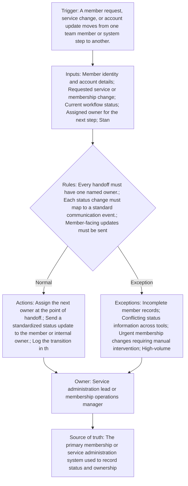

<!-- senna-roi-model-v1:{"scenarios":[{"name":"low","transactions_per_month":250,"minutes_saved_per_transaction":3,"loaded_labor_rate":16.55,"baseline_monthly_error_rework_cost":500,"error_rework_reduction_rate":0.1,"implementation_cost":1500,"monthly_maintenance":100,"monthly_labor_savings":206.875,"monthly_error_savings":50,"monthly_benefit":256.875,"annual_benefit":3082.5,"first_year_net":382.5,"payback_months":9.56175298804781},{"name":"base","transactions_per_month":600,"minutes_saved_per_transaction":5,"loaded_labor_rate":19.15,"baseline_monthly_error_rework_cost":1200,"error_rework_reduction_rate":0.2,"implementation_cost":3500,"monthly_maintenance":250,"monthly_labor_savings":957.4999999999999,"monthly_error_savings":240,"monthly_benefit":1197.5,"annual_benefit":14370,"first_year_net":7870,"payback_months":3.6939313984168867},{"name":"high","transactions_per_month":1200,"minutes_saved_per_transaction":7,"loaded_labor_rate":24,"baseline_monthly_error_rework_cost":2500,"error_rework_reduction_rate":0.3,"implementation_cost":6500,"monthly_maintenance":400,"monthly_labor_savings":3360,"monthly_error_savings":750,"monthly_benefit":4110,"annual_benefit":49320,"first_year_net":38020,"payback_months":1.752021563342318}]} -->

In recreation service administration, the work is rarely just about processing a request. It is about keeping a member informed while several people or systems touch the same account: intake, billing, membership changes, policy review, fulfillment, and sometimes a supervisor. When ownership is unclear, the result is predictable: duplicate outreach, stale status, delayed approvals, and avoidable rework. A simple handoff workflow does not remove judgment from the process; it makes judgment visible at the point where the work changes hands.

For this guide, think of the workflow as a status communication contract. Every time a membership request moves from one person or step to another, someone must own the next action, the status must be updated in one place, and the member or internal stakeholder must receive a timely message that matches the new state. The goal is not more communication. It is better-timed communication with a single source of truth.

This matters in recreation because the service environment often combines high volume, seasonal demand, and a mix of routine and exception-heavy requests. Recreation workers organize, conduct, and promote activities, but the administrative side still depends on clean transitions and clear records. The more the team relies on memory, side conversations, or scattered tools, the more likely a handoff will fail.

## Problem framing: where handoffs and updates break down

The most common failure points are easy to spot once you name them. A request arrives, but no one is clearly assigned. A status changes in one tool, but the member-facing update is skipped or sent late. A case is paused for missing information, yet the pause is not logged in the same system that shows ownership. A supervisor approves an exception, but the person closing the loop never hears about it. Each of these problems creates the same downstream effect: someone later spends time rediscovering what should already have been documented.

The practical fix is to define a handoff as a controlled event, not an informal passing of work. If a membership update moves from one queue to another, the next owner should be named immediately. If the request remains with the same owner but changes status, the communication event still needs to happen. If the account is blocked, the exception queue becomes the active owner until the blocker is resolved.

## Operational workflow: from intake to fulfillment to member communication

A workable service administration handoff usually has four stages. First is intake, where the request, identity details, and service need are captured. Second is triage, where the system or lead decides whether the request can proceed, needs more information, or requires approval. Third is fulfillment, where the change is executed. Fourth is confirmation, where the member or internal requester gets a final update and the record is closed.

At each stage, only one person or queue should be responsible for the next step. That ownership rule prevents the most common gray area: “I thought the other team had it.” If the handoff is internal, the receiving owner should see the exact status, the required follow-up, and any due time. If the handoff is external-facing, the member should receive a message that matches the current status without promising a completion time the team cannot keep.

The workflow should also distinguish between progress statuses and pause statuses. “In review,” “awaiting approval,” “waiting on member info,” and “completed” should not be used interchangeably. When status language is loose, teams lose the ability to measure cycle time and identify where work is stuck.

## Control points: ownership, timing, status definitions, and escalation rules

The strongest control point is a single source of truth for current status and ownership. That system of record should be where staff go to answer: Who owns this now? What is the next step? Is the case blocked? What message went out? If teams split those answers across email, chat, and spreadsheets, they eventually create conflicting versions of the truth.

Timing matters just as much as ownership. Member-facing updates should go out within a defined window after the status changes. The exact window can vary by service level, but it should be short enough that the update still reflects reality. Delayed updates create support calls because members are forced to ask for the status that should already have been visible.

## Workflow at a glance

## Illustrative ROI sensitivity

These are illustrative planning scenarios—not client results, promises, or guarantees. Each row exposes the inputs so you can replace them with your own operating data.

| Scenario | Transactions/mo | Minutes saved/transaction | Loaded labor rate | Baseline rework/mo | Rework reduction | Implementation | Maintenance/mo | Labor savings/mo | Rework savings/mo | Benefit/mo | Annual benefit | First-year net | Payback months |
|---|---:|---:|---:|---:|---:|---:|---:|---:|---:|---:|---:|---:|---:|
| Low | 250 | 3 | $16.55 | $500.00 | 10% | $1,500.00 | $100.00 | $206.88 | $50.00 | $256.88 | $3,082.50 | $382.50 | 9.56 |
| Base | 600 | 5 | $19.15 | $1,200.00 | 20% | $3,500.00 | $250.00 | $957.50 | $240.00 | $1,197.50 | $14,370.00 | $7,870.00 | 3.69 |
| High | 1,200 | 7 | $24.00 | $2,500.00 | 30% | $6,500.00 | $400.00 | $3,360.00 | $750.00 | $4,110.00 | $49,320.00 | $38,020.00 | 1.75 |

## How to read the sensitivity range

Labor savings move with transaction volume, minutes removed from each handoff, and the loaded labor rate. Rework savings move with the current monthly cost of exceptions and the assumed reduction rate. Monthly benefit combines those two effects; first-year net then subtracts implementation plus twelve months of maintenance. Payback uses benefit after maintenance. Treat a negative first-year net or unavailable payback as a reason to narrow the first automation step, not as a number to hide.

## The operating contract

- **Trigger:** A member request, service change, or account update moves from one team member or system step to another.
- **Required inputs:** Member identity and account details; Requested service or membership change; Current workflow status; Assigned owner for the next step; Standard message template or status update rule; Escalation contact for exceptions
- **Decision rules:** Every handoff must have one named owner.; Each status change must map to a standard communication event.; Member-facing updates must be sent within a defined time window after the workflow status changes.; If required information is missing, the workflow pauses and routes to an exception queue.; Only one source of truth is used for the current status.; Escalations are triggered when a step exceeds the service threshold or ownership is unclear.
- **System actions:** Assign the next owner at the point of handoff.; Send a standardized status update to the member or internal owner.; Log the transition in the system of record.; Flag missing information for follow-up.; Escalate stalled or ambiguous cases to a supervisor or queue owner.
- **Exception path:** Incomplete member records; Conflicting status information across tools; Urgent membership changes requiring manual intervention; High-volume periods that exceed normal response thresholds; Cases requiring manager approval or policy exception
- **Accountable owner:** Service administration lead or membership operations manager
- **Source of truth:** The primary membership or service administration system used to record status and ownership

## Preflight questions

- Which event creates the work item, and which system records that event first?
- Which fields must be present before an automated rule can run?
- Which status changes are deterministic, and which require an owner's judgment?
- Where do late, incomplete, duplicate, or contradictory records wait for review?
- Who owns each exception queue, and what is the acknowledgment expectation?
- Which system remains authoritative when two tools disagree?
- What baseline volume, handling time, and rework cost will be measured before launch?

## Evidence boundary

These public sources support the factual context below. The workflow design and control rules are recommendations; the ROI scenarios are illustrative planning models.

- Recreation workers organize, conduct, and promote a variety of group activities for leisure and other purposes. ([Authoritative source 1](https://www.bls.gov/ooh/personal-care-and-service/recreation-workers.htm))
- National estimates for Recreation Workers: ; Hourly Wage, $ 11.56, $ 14.00, $ 16.55, $ 19.15 ; Annual Wage (2), $ 24,040, $ 29,120, $ 34,410, $ 39,840 ... ([Authoritative source 2](https://www.bls.gov/oes/2023/may/oes399032.htm))
- Workers in the New York-Newark-Jersey City, NY-NJ Metropolitan Statistical Area had an average (mean) hourly wage of $41.50 in May 2025, compared to the nationwide average of $33.54. ([Authoritative source 3](https://www.bls.gov/regions/northeast/news-release/2026/occupationalemploymentandwages_newyork_20260605.htm))

## Review this bottleneck with your own numbers

Bring one recent service administration handoff workflow — customer handoff and status communication exception to a [30-minute Workflow Bottleneck Review](/workflow-bottleneck-review). We will map the trigger, status rules, ownership handoffs, exception queue, and source of truth; replace the illustrative assumptions with your operating data; and identify the next practical step without promising a predetermined result.
