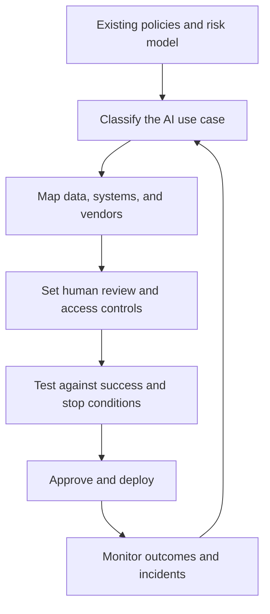

At an AI conference this week, one talk cut through a lot of abstract language about AI governance. Its clearest point was simple: a policy document, by itself, is not governance.

Governance exists when people can answer practical questions while the work is happening:

- Who is allowed to make this decision?
- Which tools, data, and use cases are approved?
- Which person remains accountable for the result?
- How will we know whether the system is working, drifting, or causing harm?

That framing matters to Senna Automation because our work lives inside real operations. We connect inboxes, forms, CRMs, ERPs, shared drives, scheduling systems, and internal tools. Adding AI to those workflows can improve speed and consistency, but it can also move data, draft customer-facing content, recommend actions, or trigger changes across systems. Governance cannot be a final document delivered after the automation is already built. It has to shape the design.

Our approach is therefore straightforward: **we work within a client's existing governance model when one exists, and help establish a right-sized operating baseline when it does not.**

## Governance should be an operating system, not a roadblock

Good governance is often described as a brake on innovation. We see it differently. Clear guardrails let a team move faster because people do not have to renegotiate the rules every time a new use case appears.

If employees know which data can go into which tools, who approves a high-impact workflow, when human review is required, and how to report a problem, responsible experimentation becomes easier. The alternative is slower and riskier: every question becomes an exception, useful tools spread through unofficial channels, and no one has a reliable picture of what the organization is actually using.

This is consistent with established frameworks. The NIST AI Risk Management Framework organizes AI risk work around four connected functions: govern, map, measure, and manage. NIST also emphasizes that these activities are contextual and continuous, not a one-time checklist. ISO/IEC 42001 takes a management-system approach, requiring organizations to establish, implement, maintain, and continually improve how they manage AI.

The shared lesson is practical: governance is a recurring way of making and checking decisions.

## How Senna works within an existing governance model

Many clients already have relevant controls, even if they do not call them "AI governance." They may have an information security program, data classification policy, vendor review process, quality management system, model risk framework, change-control process, records policy, or legal and compliance review.

We do not arrive with a competing policy and ask the organization to reorganize around our preferred framework. We start by mapping the proposed automation into the model already in place.

In practice, that means we identify:

- the business owner and technical owner for the workflow
- the applicable data classes and retention rules
- systems the workflow may read from or write to
- approved vendors and contract requirements
- the client's risk tier and approval path
- required testing, documentation, and evidence
- human review, escalation, and appeal requirements
- monitoring, change control, and incident reporting expectations

The deliverable is not just a control map. Those requirements become part of the automation itself: permissions, approval gates, logs, exception queues, notifications, test cases, and shutdown procedures.

If a client's framework uses NIST language, we can document the workflow in those terms. If it is aligned to ISO/IEC 42001, SOC 2 controls, a quality system, or an internal risk matrix, we use that structure. The goal is traceability without needless duplication.

## The controls we build into an AI-enabled workflow

Every project is different, but the conference talk reinforced several practices that translate directly into implementation work.

### 1. A named human owner

Every significant AI use case needs someone who owns the business outcome. "The AI did it" is not an accountability model. The owner helps define acceptable performance, approves changes, and decides when the workflow should be paused.

Senna also identifies who owns the technical operation: access, integrations, logs, incident triage, and maintenance. In a small company, one person may wear both hats. In a larger organization, responsibility may be split across operations, IT, security, legal, and compliance.

### 2. Data rules people can actually apply

The most useful question is rarely "Is AI safe?" It is: **Is this data safe in this tool for this use case?**

Before connecting an AI service, we map what the workflow receives, where the information is stored, who can access it, whether a provider can use it for model training, how long it is retained, and what happens when the service relationship ends.

We then translate the client's data classifications into concrete workflow rules. Public material may be permitted in an approved tool. Internal or confidential material may require a business-tier account, specific contractual terms, or a private deployment. Regulated data may be prohibited unless the client has verified that the complete system meets the necessary requirements.

### 3. Oversight that matches the stakes

Not every AI output needs the same review. A brainstorming aid and a system that influences hiring, pricing, payments, health, safety, or legal rights should not share an approval path.

We use the client's risk tiers where they exist. When they do not, we help separate low-, medium-, and high-impact work so review scales with consequence:

- Low-impact assistance can operate under clear acceptable-use rules.
- Customer-facing content, code, and analysis that drives action usually require a named reviewer and disclosure rules.
- Decisions involving money, employment, safety, health, or rights require formal review, documented approval, notice where appropriate, and a meaningful human escalation path.

This makes human review part of the normal workflow rather than an honor system added after the fact.

### 4. Vendor diligence before integration

An AI vendor's behavior becomes part of the client's risk surface. Before deployment, we help document five basic questions:

- Is client data used to train the vendor's models?
- Where is the data stored, and who can access it?
- Which security or AI-management certifications and reports are available?
- What happens to the data when the client leaves?
- Which AI features are enabled by default, and what responsibility belongs to each party?

The answers influence architecture. A workflow may need redaction before a model call, a different provider, a regional hosting option, shorter retention, fewer permissions, or no AI at all for a particular step.

### 5. Testable success and stop conditions

"Use AI responsibly" is not a test plan. Before launch, we define what good performance looks like and what would cause the system to pause.

Depending on the workflow, measures may include extraction accuracy, false routing rates, human override frequency, turnaround time, exception volume, customer complaints, or differences in outcomes across relevant groups. We also test failure modes: missing data, malicious instructions, unavailable systems, duplicated requests, and unauthorized access attempts.

For autonomous or agentic workflows, the controls get stricter. We apply least-privilege access, limit which systems and actions the agent can use, preserve an audit trail, set transaction or volume boundaries, and test a real kill switch. An agent that can act across systems should be treated more like a new operator than a smarter search box.

### 6. Monitoring and an incident path after launch

Deployment is the beginning of governance, not the end. Models change, vendors change features, business processes evolve, and employees find new uses for a tool.

We design enough visibility to answer what happened: which input was processed, which version or configuration ran, what output was produced, whether a person approved it, and what downstream action followed. We define who receives alerts, how an incident is contained, and how affected records are reviewed.

The workflow should also have a review rhythm. That can be lightweight for a small internal assistant or more formal for a high-impact system, but it should be real.

## What if a client has no AI governance model yet?

Not every organization needs a large committee or a thick manual. A smaller business can establish a useful foundation with a named owner, a concise policy, an inventory of AI uses, and a repeatable review path.

A right-sized starting point usually includes:

- one accountable AI owner or small cross-functional group
- an inventory of current tools, vendors, and use cases—including unofficial ones disclosed without punishment
- a short acceptable-use policy with concrete examples
- simple data classifications tied to approved tools
- risk tiers that determine review and documentation
- a vendor questionnaire and contract review path
- baseline training for employees, power users, and leaders
- a clear incident channel, audit trail, and review cadence

That baseline should fit the organization. A ten-person service company may keep it to a page and a register. A regulated manufacturer or healthcare-adjacent organization may need formal evidence, separation of duties, and alignment with several existing control systems.

## What clients can expect from Senna

For Senna Automation, governance is part of the build—not a separate promise in a proposal. We will ask about ownership, approved data use, review thresholds, vendor obligations, logging, incidents, and change control during discovery. We will document how those decisions affect the workflow. We will implement the technical controls that fall within the project and clearly identify the responsibilities that remain with the client or another vendor.

We are an automation and implementation partner, not a law firm or certification body. Legal interpretations, regulatory applicability, and formal certification remain with qualified counsel, auditors, and the client's governance leaders. Our role is to make the agreed model operational in the systems we build.

The goal is not perfect paperwork. It is responsible automation that people can understand, operate, question, and stop when necessary. That is the kind of governance that earns trust—and lets useful AI move from a pilot into the real business.

## Sources and further reading

- NIST, [AI Risk Management Framework](https://airc.nist.gov/airmf-resources/airmf/)
- NIST, [AI RMF Playbook](https://airc.nist.gov/airmf-resources/playbook/)
- ISO, [ISO/IEC 42001:2023 — Artificial intelligence management system](https://www.iso.org/standard/42001)

> **The practical commitment**
>
> Senna Automation will work within your existing governance model—not build a competing system beside it.
>
> If no model exists yet, we will help establish a right-sized baseline with clear ownership, data rules, human review, monitoring, and a tested path for stopping the workflow when necessary.
>
> The result is automation your team can understand, operate, question, and trust.
