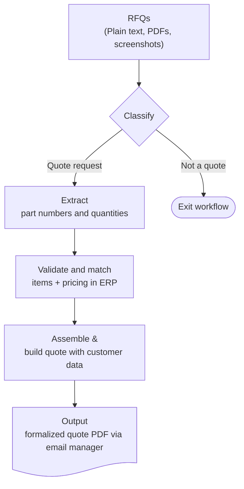

The Request for Quote (RFQ) process is the lifeblood of B2B sales, but it's often fraught with manual inefficiencies. Customers send messy, unstructured emails requesting pricing, sometimes in the body text, sometimes buried in an attached PDF. Historically, support agents have to read these emails, decipher part numbers from descriptive text, log into an ERP system, manually enter each line item to verify pricing, and then generate a quote document.

To eliminate this bottleneck, we designed a fully automated n8n workflow that uses artificial intelligence to digest unstructured emails and instantly output a formal Quote PDF.

## The challenge: Messy inboxes and complex data

When an organization receives hundreds of emails a week in an unassigned inbox, just sorting through the noise is a massive undertaking. A potential workflow could easily break if it tries to generate a quote for a simple "Thank you" email, or if it accidentally picks up non-product numbers like phone numbers and ZIP codes.

We needed a system that was smart enough to understand the context of the emails, robust enough to extract highly specific technical part IDs, and capable of integrating deeply with existing internal databases.

### Categorizing the Request

Before attempting any data extraction, the system must confirm that an incoming email actually requires a quote. To solve this, the workflow monitors a targeted Front.com inbox and routes new unassigned email threads through an Azure OpenAI intent classifier. The AI is specifically prompted to detect if a message is requesting new quotes rather than asking about existing quantity discounts or order updates. Only verified quote requests are allowed to proceed down the pipeline, keeping the system efficient and preventing misfires.

## The solution: Intelligent extraction & automated quoting

The core of the workflow leverages LangChain and GPT models as an intelligent translation layer between messy human requests and strict database schemas.

### AI-Powered Data Extraction

The most critical and complex step is pulling precise, structured product data out of raw text. If an email includes a PDF attachment, the workflow automatically downloads it, parses the text locally using a temporary container command, and deletes the file.

Next, the combined text is fed into a heavily tuned Information Extractor node. Because ERP systems require exact part numbers to function, we wrote strict AI contracts:

- The model must return purely the raw product identifiers (e.g., SKUs or part numbers) and requested quantities.
- It must ignore descriptive branding like "SERVICE KIT" or "GASKET" next to the numbers.
- It must gracefully default to a quantity of 1 if none is specified, while ignoring dimensions, serial numbers, or irrelevant digits.

This strict extraction transforms a paragraph of text perfectly into a structured JSON array of products.

### Seamless ERP Integration

Once the AI locks down the structured list of parts and quantities, the workflow connects seamlessly to the company's internal "Control Tower" API:

[[QUOTE_AUTOMATION_ERP_STEPS]]

By combining the reasoning capabilities of modern LLMs with rigid API orchestration, what traditionally took a sales team several minutes of tedious administrative work per email is now completed flawlessly in the background in just seconds.
