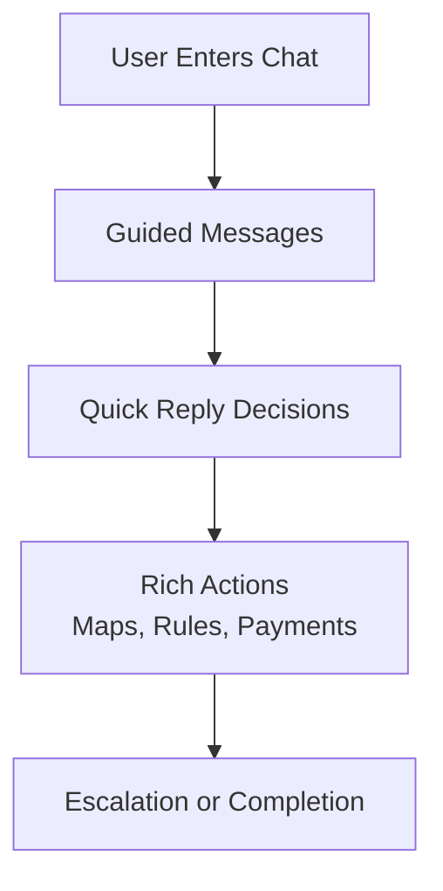

For many digital products, the default assumption is that users need to download and navigate a full application. But in reality, most user journeys are linear, task-driven, and could be handled more efficiently through a guided interface.

That was the premise behind this demo.

We built a conversational experience that simulates how a guest could navigate an entire stay using messaging alone. Instead of opening multiple apps or interfaces, the user moves through a structured journey inside a single chat thread.

## The challenge: Reducing friction in multi-step user journeys

Traditional guest experiences often require switching between multiple tools:

- messaging platforms for communication
- maps for directions
- documents for house rules
- payment systems for upsells
- support channels for escalation

Each step introduces friction, context switching, and cognitive load.

The goal was to explore whether a single conversational interface could unify all of these actions into one seamless flow.

## The solution: A fully guided messaging experience

We designed a browser-based demo that simulates an RCS-style business messaging environment.

Instead of static content or navigation menus, the system guides the user through a structured sequence of interactions. Messages appear with realistic timing, quick replies drive decision points, and rich components allow deeper actions without leaving the conversation.



```steps
01 | Structured Messaging Flow
The experience is built around a scripted conversation that simulates a real interaction between a guest, a concierge system, and a host.

The flow includes:
- welcome messaging
- directions and navigation
- house rules access
- upsell opportunities
- escalation to a human

**Messages are timed and sequenced to feel natural rather than automated, creating a more engaging experience.**
---
02 | Actionable Interface Components
Instead of limiting the experience to plain text, the system introduces interactive elements directly within the chat.

These include:
- quick reply buttons for decision making
- rich cards that open maps or internal pages
- embedded flows for completing actions
- contextual UI elements that respond to user input

**This transforms the conversation from passive messaging into an active interface.**
---
03 | Integrated Transaction Flows
A key part of the demo is the ability to complete transactions without leaving the chat.

The system simulates:
- payment flows similar to Apple Pay
- wallet-style confirmations
- temporary modal interactions that return to the conversation

**This demonstrates how messaging can handle not just communication, but also conversion.**
---
04 | Realistic Interaction Design
To make the experience feel authentic, the system includes:
- typing indicators
- controlled message pacing
- conditional pauses for user input
- smooth UI transitions

**These details are critical. Without them, the experience would feel scripted rather than conversational.**
```

## Technical approach

The demo is built using a modern frontend stack designed for flexibility and rapid iteration.

Key components include:

- a message-driven architecture where each interaction is defined as a node
- reusable UI components for different message types
- a context system to manage timing and flow control
- a browser-based container styled to mimic a real messaging client

This structure makes it easy to:

- modify the conversation flow
- add new scenarios
- adjust pacing and interaction timing
- swap out content dynamically

## Why this matters for potential clients

Most businesses think about messaging as a support channel.

This approach reframes it as a primary interface.

Instead of building full applications or complex dashboards, you can guide users through high-value workflows using structured conversations. That has several advantages:

- lower friction for users
- faster time to interaction
- reduced development complexity
- more controlled user journeys
- easier experimentation and iteration

For industries like hospitality, services, onboarding, and customer support, this model can significantly simplify how users interact with your product.

## The outcome: A new interface paradigm

The demo shows that messaging can go far beyond simple communication.

By combining structured flows, interactive components, and embedded actions, it becomes a complete interface layer capable of handling complex user journeys.

What traditionally required multiple tools and touchpoints can now be delivered through a single, guided conversation.

> **The bigger opportunity**
>
> Messaging is evolving from a communication layer into an execution layer.
>
> When designed correctly, it can replace entire categories of interfaces by guiding users step by step through exactly what they need to do.
>
> For businesses, that means fewer barriers, more engagement, and a more direct path from intent to action.
