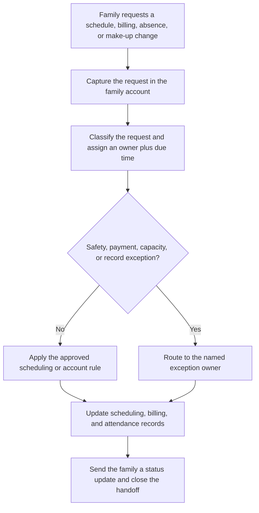

This guide is for dance studios, gymnastics gyms, swim schools, martial arts academies, camps, tutoring programs, and other children’s activity businesses. In these companies, the parent or guardian is usually the customer and account holder, while the child is the participant. One family may also have several children, classes, payment arrangements, absences, and make-up credits attached to the same account.

That is why families are central to this workflow. A request that sounds simple—“Can we switch Tuesday’s class?”—may affect enrollment capacity, instructor rosters, billing, attendance, and a make-up balance. When the front desk, program lead, and billing team each own a different piece, the family experiences the gaps between those people as one broken promise.

The software used by this industry reflects that operating reality. [Jackrabbit Class](https://www.jackrabbitclass.com/features/parent-family-experience/) describes a parent portal that brings account details, enrollment, messages, absences, and make-ups together. [iClassPro](https://www.iclasspro.com/class-management) groups scheduling, billing, attendance, and communication for children’s activity centers. [SportsEngine Motion](https://www.sportsengine.com/motion/) similarly connects schedules, messages, payments, attendance, and make-up credits. The opportunity is not to add another inbox. It is to make the handoff between those functions visible and accountable.

## Where customer handoffs break

Most missed updates start with a reasonable action. A coach mentions an absence to the front desk. A parent sends a billing question by text. An administrator promises to check class capacity. Someone forwards a message to a colleague. Each person has moved the request forward, but no shared record says who owns the next action or when the family will hear back.

Four pitfalls appear repeatedly:

- **The channel becomes the task list.** Email, voicemail, direct messages, and hallway conversations hold work that should be in one queue.
- **A forward is mistaken for acceptance.** The first staff member assumes the next person owns the request before that person has acknowledged it.
- **The family record trails reality.** Staff make a decision but do not update the scheduling, billing, or attendance system that everyone else checks.
- **Exceptions have no lane.** Safety concerns, payment disputes, class-capacity conflicts, and incomplete records sit beside routine requests even though they need different owners.

More reminders do not resolve those design problems. The workflow needs an explicit trigger, a minimum set of inputs, decision rules, an exception path, and one source of truth.

## A handoff workflow staff can follow

The workflow begins whenever a family asks for a schedule, billing, absence, enrollment, or make-up change. The first staff member does not need to solve everything. They need to capture enough context for the request to move without another round of detective work.

The key control is acceptance. A handoff is not complete when one person forwards a message; it is complete when the next owner accepts it, the due time is visible, and the family has an appropriate status update. That small distinction prevents work from disappearing between roles.

## Define the operating contract

Start with a narrow contract that staff can use during a busy shift.

### Trigger and required inputs

The trigger is an incoming family request or an internal status change that requires another person to act. Required inputs should include the family and participant record, request type, relevant class or invoice, promised response time, current owner, and any attachment or note needed to decide the request.

Do not require every possible field before creating the work item. Capture the essentials, then let a missing required field route to an incomplete-record exception instead of leaving the request in someone’s inbox.

### Rules and system actions

Routine rules should cover requests such as approved class transfers, standard absence reporting, available make-up credits, and ordinary payment-status questions. The system actions can create the task, assign the correct queue, set a due time, send an acknowledgment, and write the status back to the family account.

Automation should support ownership rather than obscure it. Every active request needs one owner. Shared queues can receive work, but a named person should accept it before the service-level clock is considered covered.

### Exception handling

Keep exception categories short and operational. A useful starting set is safety or medical information, disputed payment, class-capacity conflict, missing authorization, and contradictory account data. Each category needs a named owner, an acknowledgment expectation, and a clear place to wait.

An exception should not disappear from the normal reporting view. It should show why the standard path paused, who is deciding it, the next review time, and what the family has already been told.

### Source of truth and closure

Choose the customer or class-management platform as the source of truth whenever possible. Email and messaging tools can deliver notifications, but they should not be the only place that records status. If two systems disagree, the operating contract must say which one wins and how the other is corrected.

Close the request only after the authoritative record is updated and the family has received the final answer or a documented next-update time. That gives managers a clean definition of completed work and gives staff a reliable history when the family contacts them again.

## Illustrative ROI sensitivity

The scenarios below are illustrative planning estimates, not client results or guarantees. Replace the transaction volume, minutes saved, loaded labor rate, baseline error or rework cost, assumed rework reduction, implementation cost, and monthly maintenance with your own measurements.

[[ROI_SENSITIVITY]]

Labor savings are calculated from monthly handoff volume, minutes removed per handoff, and the loaded labor rate. Rework savings apply the assumed reduction to the current monthly cost of corrections, credits, repeated outreach, and staff time spent reconstructing status. Monthly benefit combines labor and rework savings. First-year net then subtracts implementation and twelve months of maintenance; payback uses monthly benefit after maintenance.

The low scenario is intentionally useful: it shows that automation can be operationally sound without being the right first investment at that scope. If the conservative case remains negative, narrow the implementation, improve the baseline measurement, or fix the operating contract before adding software.

## Measure the workflow before automating it

For two weeks, tag every qualifying handoff with its request type, channel, owner, time opened, time accepted, time closed, exception reason, and number of customer follow-ups. That baseline will reveal whether the main constraint is intake, ownership, decision time, or recordkeeping.

Then automate one repeatable path. A good first candidate has meaningful volume, stable rules, visible rework, and an exception owner who can handle what the rules cannot decide. Review the queue with staff after launch; their workarounds are evidence that the workflow or interface still needs adjustment.

## Review this bottleneck with your own numbers

Bring one recent family-request handoff to a [30-minute Workflow Bottleneck Review](/workflow-bottleneck-review). We will map the trigger, required inputs, ownership changes, decision rules, exception queue, and source of truth; replace the illustrative assumptions with your operating data; and identify the next practical step together.
