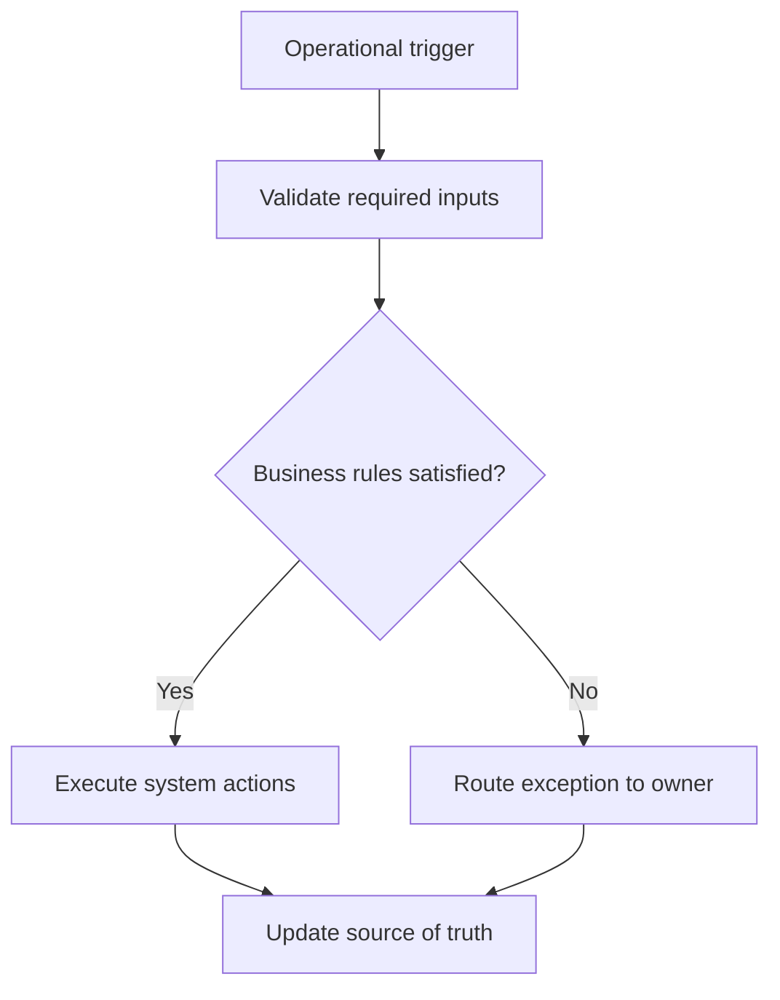

<!-- senna-roi-model-v1:{"scenarios":[{"name":"low","transactions_per_month":300,"minutes_saved_per_transaction":3,"loaded_labor_rate":24,"baseline_monthly_error_rework_cost":600,"error_rework_reduction_rate":0.15,"implementation_cost":3500,"monthly_maintenance":250,"monthly_labor_savings":360,"monthly_error_savings":90,"monthly_benefit":450,"annual_benefit":5400,"first_year_net":-1100,"payback_months":17.5},{"name":"base","transactions_per_month":700,"minutes_saved_per_transaction":5,"loaded_labor_rate":28,"baseline_monthly_error_rework_cost":1400,"error_rework_reduction_rate":0.25,"implementation_cost":6500,"monthly_maintenance":400,"monthly_labor_savings":1633.3333333333335,"monthly_error_savings":350,"monthly_benefit":1983.3333333333335,"annual_benefit":23800,"first_year_net":12500,"payback_months":4.105263157894736},{"name":"high","transactions_per_month":1200,"minutes_saved_per_transaction":7,"loaded_labor_rate":32,"baseline_monthly_error_rework_cost":2600,"error_rework_reduction_rate":0.35,"implementation_cost":11000,"monthly_maintenance":700,"monthly_labor_savings":4480,"monthly_error_savings":909.9999999999999,"monthly_benefit":5390,"annual_benefit":64680,"first_year_net":45280,"payback_months":2.345415778251599}]} -->

Membership-based activity operations live and die on clarity. Families do not distinguish between a billing question, a schedule change, a make-up class request, or a check-in about an absent child; they experience all of it as one promise: someone will respond, and the next step will be visible. When handoffs are inconsistent, the operational damage is wider than a slow reply. Staff duplicate work, customers chase updates, and unresolved items bounce between inboxes until they become exceptions.

That is why the problem is best treated as a service administration handoff workflow, not as a “communication training” issue. In a high-volume environment, the goal is not perfect memory or heroic follow-through. The goal is a repeatable path where every status change names an owner, every owner knows the next action, and every customer-facing update comes from the same source of truth. The result is fewer missed updates, fewer side messages, and fewer moments where the team believes someone else already handled the customer.

This guide focuses on the handoff path itself: how work moves, where it stalls, and what operating rules keep ownership visible. It is written for operations managers and service administration leads who need a practical standard that front-line staff can actually use.

## Problem framing

Missed updates usually come from three structural weaknesses. First, ownership is implied rather than assigned, so the current task and the next task are both “somebody’s job.” Second, status lives in multiple places: a note in one inbox, a verbal handoff in another, and a customer record that may not reflect either. Third, updates are treated as optional unless the issue feels urgent.

In children’s activities, those weaknesses compound quickly because the work is continuous and customer expectations are immediate. Families ask for confirmation, timing, and reassurance. Staff are often balancing enrollment, attendance, make-up scheduling, payment questions, and exception handling at the same time. A handoff that is clear internally but invisible in the system still creates a failure externally.

The practical fix is to define the handoff as a controlled sequence with a standard trigger, a minimum set of inputs, and a mandatory update point. Workflow automation is valuable here because it reduces reliance on human memory and makes the sequence repeatable across dozens or hundreds of daily transactions. Evidence on workflow automation consistently emphasizes connecting the workflow end to end rather than optimizing isolated tasks.

## Why handoff inconsistency happens

In these operations, inconsistency is rarely caused by one person skipping a step. More often, the workflow itself allows ambiguity. A staff member receives a request, works part of it, then forwards it with partial context. The next person assumes the customer has already been updated. Meanwhile, the source record is incomplete, so the team cannot say with confidence what was promised, what is pending, or who owns the next outreach.

The most common failure points are:

- The prior owner closes their task before the next owner accepts it.
- The team uses messages, calls, or hallway conversations as the real status source.
- A blocked item is passed along without recording the blocker.
- Customers are only updated when staff remember, not at predefined milestones.
- Exceptions are handled informally, which makes later follow-up harder.

The fix is not more reminders. It is a stronger operating contract.

## Workflow to standardize customer handoffs

Use one standard path for every membership-related status change, request, or update inquiry. The owner should be the operations manager or service administration lead, but the workflow must be executed by whoever is assigned to the queue.

## Workflow at a glance

## Illustrative ROI sensitivity

These are illustrative planning scenarios—not client results, promises, or guarantees. Each row exposes the inputs so you can replace them with your own operating data.

| Scenario | Transactions/mo | Minutes saved/transaction | Loaded labor rate | Baseline rework/mo | Rework reduction | Implementation cost | Maintenance/mo | Labor savings/mo | Rework savings/mo | Benefit/mo | Annual benefit | First-year net | Payback months |
|---|---:|---:|---:|---:|---:|---:|---:|---:|---:|---:|---:|---:|---:|
| Low | 300 | 3 | $24.00 | $600.00 | 15% | $3,500.00 | $250.00 | $360.00 | $90.00 | $450.00 | $5,400.00 | $-1,100.00 | 17.5 |
| Base | 700 | 5 | $28.00 | $1,400.00 | 25% | $6,500.00 | $400.00 | $1,633.33 | $350.00 | $1,983.33 | $23,800.00 | $12,500.00 | 4.11 |
| High | 1,200 | 7 | $32.00 | $2,600.00 | 35% | $11,000.00 | $700.00 | $4,480.00 | $910.00 | $5,390.00 | $64,680.00 | $45,280.00 | 2.35 |

## How to read the sensitivity range

Labor savings move with transaction volume, minutes removed from each handoff, and the loaded labor rate. Rework savings move with the current monthly cost of exceptions and the assumed reduction rate. Monthly benefit combines those two effects; first-year net then subtracts implementation plus twelve months of maintenance. Payback uses benefit after maintenance. Treat a negative first-year net or unavailable payback as a reason to narrow the first automation step, not as a number to hide.

## The operating contract

- **Trigger:** A customer status changes, a handoff is required, or a customer asks for an update about a membership-related issue.
- **Required inputs:** Customer record; Current status; Next owner or department; Required customer message; Timestamp of handoff; Open tasks or exceptions
- **Decision rules:** Every handoff must name one owner before the prior owner closes their task.; Every status change must be logged in the same system of record used by the team.; Customers must receive a status update at each predefined milestone, even if the update is simply that the request is still in progress.; If the issue is blocked, the blocker and expected next step must be recorded before the handoff is considered complete.; No staff member may rely on memory or side messages as the official status source.
- **System actions:** Route the item to the next owner with the minimum required context.; Send the customer a standardized status update template.; Record the handoff timestamp, owner, and next action in the source system.; Escalate unresolved exceptions after a defined time threshold.; Close the loop with the customer once the final action is completed.
- **Exception path:** Urgent child-safety, billing dispute, or compliance issues may bypass the normal queue but still require a documented owner and status update.; If the source record is incomplete, the workflow pauses until the missing field is filled or an exception owner is assigned.; If the customer cannot be contacted, the team records the attempt and the next outreach time.
- **Accountable owner:** Operations manager or service administration lead
- **Source of truth:** The team’s customer record system and handoff log

## Preflight questions

- Which event creates the work item, and which system records that event first?
- Which fields must be present before an automated rule can run?
- Which status changes are deterministic, and which require an owner's judgment?
- Where do late, incomplete, duplicate, or contradictory records wait for review?
- Who owns each exception queue, and what is the acknowledgment expectation?
- Which system remains authoritative when two tools disagree?
- What baseline volume, handling time, and rework cost will be measured before launch?

## Evidence boundary

These public sources support the factual context below. The workflow design and control rules are recommendations; the ROI scenarios are illustrative planning models.

- Background Workflow automation, which involves identifying sequences of tasks that can be streamlined by using technology and modern computing, offers opportunities to address the United States health care system&#x27;s challenges with quality, safety, ... ([Authoritative source 1](https://pmc.ncbi.nlm.nih.gov/articles/PMC8318703/))
- Childcare workers attend to children&rsquo;s needs while helping to foster early development. ([Authoritative source 2](https://www.bls.gov/ooh/personal-care-and-service/childcare-workers.htm))
- 35 percent of employed people did some or all of their work. Usual weekly earnings are updated in the ATUS for about 40 percent of wage and ... ([Authoritative source 3](https://www.bls.gov/news.release/atus.htm))

## Review this bottleneck with your own numbers

Bring one recent service administration handoff workflow — customer handoff and status communication exception to a [30-minute Workflow Bottleneck Review](/workflow-bottleneck-review). We will map the trigger, status rules, ownership handoffs, exception queue, and source of truth; replace the illustrative assumptions with your operating data; and identify the next practical step without promising a predetermined result.
