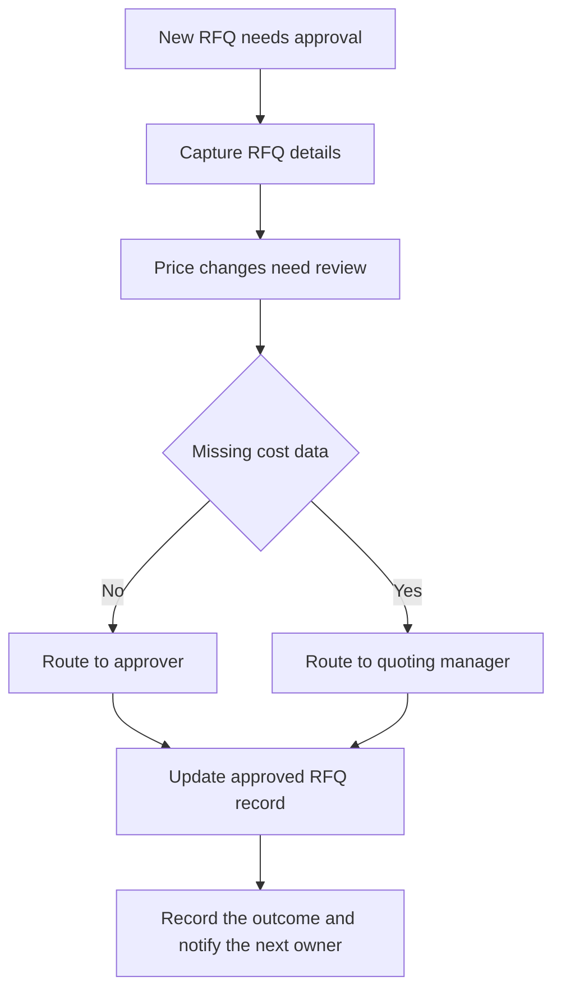

Contract manufacturers, assembly operations, and production suppliers all live with the same tension: quotes have to move fast, but pricing decisions cannot become tribal knowledge. In an RFQ environment, one loose spreadsheet, one off-platform email thread, or one unrecorded exception can create downstream confusion for estimating, procurement, and production leaders. The result is not just delay. It is uncertainty about which version is real, who approved it, and whether the approved pricing still matches the work that will be released.

That is why the approval and routing workflow needs to be treated as a controlled business process, not a courtesy step. The goal is simple: every decision should be traceable, every exception should be explained, and every approved quote should become the source of truth for the next handoff. When the process is clear, teams can route quotes without losing control, even when customer specs change or margin pressure pushes a deal outside normal boundaries.

The sections below focus on the practical mechanics of RFQ approval controls: who needs to touch the quote, what the workflow must enforce, how to handle exceptions without breaking auditability, and how to think about operating impact in a conservative way. Every financial example in this guide is illustrative and based on disclosed assumptions, not client results or guarantees.

## Why RFQ approvals break down in contract manufacturing teams

RFQ approvals usually break down for predictable reasons. The first is version drift: a quote gets revised, but the approving leader sees an earlier draft or a forwarded attachment with no clear lineage. The second is role ambiguity: estimators, production leaders, and account owners all think someone else is responsible for the sign-off. The third is exception sprawl: discounts, late customer changes, or missing cost inputs are handled ad hoc, so the final quote may be approved without a consistent record of why it changed.

In contract manufacturing, these issues are amplified because quotes are not isolated documents. They often connect customer specs, costed quote assumptions, supplier input, and the eventual production plan. If the approval step does not preserve that chain, the team may still close the RFQ, but it will struggle later when someone asks why the price was accepted or whether the quoted scope matched the released work.

The best control point is the approved RFQ record. That record should carry the current version, the required approver, the exception history, and the final decision. If a quote is approved outside that record, the workflow has already started to lose its audit trail.

## Who must touch the quote and why account relationships matter

A clean approval workflow starts with stakeholder mapping. In most contract manufacturing teams, the quoting manager owns the process, but the actual quote may require input from estimating, operations, and account leadership before it can move. The right question is not simply “who can click approve?” It is “who needs to be involved so the decision is both commercially sound and operationally executable?”

Account relationships matter because the customer-facing owner often understands context that the estimator does not. They may know whether the buyer is testing a price point, whether the scope has shifted, or whether a negotiated term makes a margin exception acceptable. Meanwhile, production leaders can catch capacity or feasibility issues that should block approval until the quote is corrected. The workflow should preserve these handoffs instead of burying them in email.

Ownership should be explicit at each stage. The quoting manager should confirm routing rules, the approver should record the decision, and the next owner should be notified only after the approval state is resolved. That sequencing reduces confusion when multiple people are touching the same RFQ package.

## What the approval and routing workflow should do

A useful workflow is deterministic: a new RFQ enters the queue, the system evaluates the required review path, and the quote moves forward only when the rule conditions are satisfied. The inputs usually include RFQ details, the costed quote, customer specs, and revision history. Those inputs should not live in separate places if the organization expects reliable routing.

At a minimum, the workflow should route to the right approver, record the approval decision, notify the next owner, and release the approved quote to the customer-facing owner only after approval is complete. Approved quotes should lock the version so later edits do not overwrite the decision that was already made. If a new revision is required, the system should create a fresh approval cycle rather than silently altering the record.

This is also where pricing rules matter. If a price change needs review, the workflow should detect it and pause for sign-off. If an over-limit discount appears, the quote should not slip through on a side conversation. A controlled workflow can still be flexible, but flexibility should happen through rules, not memory.

## Approval controls, audit trail, and exception handling

Exception handling is where weak workflows tend to fail. Missing cost data should not be patched in later without a visible note. A late customer change should trigger a re-review, not a quiet edit. A conflict in version should stop the process until the team identifies which document is current. Each exception should be captured with a written reason so the final quote can be defended later.

The audit trail should show who touched the quote, what changed, when it changed, and why the final decision was made. Timestamped handoffs are especially important because they make it easier to reconstruct the sequence when questions come up after the quote is released. That visibility protects the team as much as it protects the business.

## Workflow at a glance

## Define the operating contract

### Trigger and required inputs

The trigger is **new RFQ needs approval**.

Required inputs:

- RFQ details.
- Costed quote.
- Customer specs.
- Revision history.

### Decision rules and system actions

- Price changes need review.
- Exceptions need written reason.
- Approved quote locks version.
- Every handoff is timestamped.
- Route to approver.
- Record approval decision.
- Notify next owner.
- Release approved quote to the customer-facing owner.

### Exception handling

- Missing cost data.
- Late customer change.
- Over-limit discount.
- Conflict in version.

### Ownership and source of truth

The accountable owner is the quoting manager. The source of truth is the approved RFQ record.

## Illustrative ROI sensitivity

These are illustrative planning scenarios—not client results, promises, or guarantees. Replace the transaction volume, minutes saved, loaded labor rate, baseline error or rework cost, assumed rework reduction, implementation cost, and monthly maintenance with your own measurements.

[[ROI_SENSITIVITY]]

## How to read the sensitivity range

Labor savings move with transaction volume, minutes removed from each handoff, and the loaded labor rate. Rework savings move with the current monthly cost of exceptions and the assumed reduction rate. Monthly benefit combines those two effects; first-year net then subtracts implementation plus twelve months of maintenance. Payback uses benefit after maintenance. Treat a negative first-year net or unavailable payback as a reason to narrow the first automation step, not as a number to hide.

## Preflight questions

- Which event creates the work item, and which system records that event first?
- Which fields must be present before an automated rule can run?
- Which status changes are deterministic, and which require an owner's judgment?
- Where do late, incomplete, duplicate, or contradictory records wait for review?
- Who owns each exception queue, and what is the acknowledgment expectation?
- Which system remains authoritative when two tools disagree?
- What baseline volume, handling time, and rework cost will be measured before launch?

## Sources used for industry context

These public sources support the operating context. The workflow recommendations are Senna Automation's analysis, and the ROI scenarios are illustrative planning estimates.

- [proshoperp.com](https://proshoperp.com/product/estimating-quoting/): ProShop describes estimating and quoting software that automates quotes with shop-floor data, applies pricing rules, and converts approved quotes to work orders.
- [bls.gov](https://www.bls.gov/oes/2023/may/oes519199.htm): The BLS occupational profile for production workers provides wage context for manufacturing labor assumptions.
- [bls.gov](https://www.bls.gov/careeroutlook/2026/article/manufacturing.htm): Among the industries in table 2, aerospace product and parts manufacturing had the highest median annual wage in 2024 of $91,630, the third-highest pay of all manufacturing industries.
- [bls.gov](https://www.bls.gov/oes/current/oessrci.htm): BLS industry-specific occupational employment and wage estimates provide a public reference point for manufacturing workforce cost context.

## Review this bottleneck with your own numbers

Bring one recent example of controls, auditability, and accountable approvals to a [30-minute Workflow Bottleneck Review](/workflow-bottleneck-review). We will map the trigger, status rules, ownership handoffs, exception queue, and source of truth; replace the illustrative assumptions with your operating data; and identify the next practical step without promising a predetermined result.
